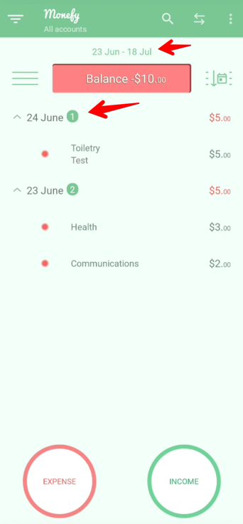

# 📋 Exploratory Testing Charter 1: Expense Entry and Management

## 🎯 Purpose
Explore the core functionality of adding, editing, and deleting expenses to ensure smooth and accurate transaction management.

## ⏱️ Timebox
25 minutes

## 💻 Test Environment
- Android 13, OnePlus 9
- App version: 1.22.2 Latest available on Google Play
- Internet: Wi-Fi and Offline Mode

## 📦 Test Data
- Categories: Food, Transport, Health, etc
- Payment Methods: Cash, Payment Card

## 👤 Tester
Prasad M

---

## 📊 Charter Prioritisation
| Charter | Priority | Reason |
|---------|----------|--------|
| Expense Management | High | Core functionality, directly impacts the purpose of the app. |

---

## ⚠️ Risks to Mitigate
- Expense data is not saved properly.
- UI/UX issues across devices.
- Expense data not saved while in offline/airplane mode.
- Input validations are missing or inadequate, allowing invalid or incomplete expense data.
- Data corruption or loss when multiple users try to modify the same expense simultaneously.
- Expense totals, taxes, or other computed fields are calculated incorrectly after modification.
- Incorrect expense calculations can lead to financial mismanagement for the user.
- Incorrect balance/expense date range can confuse the user and lead to incorrect data.
- Missing validations can result in incomplete or inaccurate records.

---

## 📝 Findings

| Action                                 | Expected Result                                                                                                                                           | Actual Result                                                                                  | Status           |
|----------------------------------------|-----------------------------------------------------------------------------------------------------------------------------------------------------------|------------------------------------------------------------------------------------------------|------------------|
| Add new expense                        | Clicking on +-X🟰 in sequence while entering expense should do nothing to expense amount, need to discuss with PM why +-X= exists here in the first place | Clicking on +-X🟰 in sequence resets the expense value to 1                                    | ❌ Fail [BUG-402] |
| Edit expense                           | Edited expense should update correctly                                                                                                                    | Edit worked correctly                                                                          | ✅ Pass           |
| Delete expense                         | Expense should be removed and balance should update                                                                                                       | Expense deleted correctly                                                                      | ✅ Pass           |
| Add expense without selecting category | Should not be possible to add expense without category                                                                                                    | Not possible to add expense without category                                                   | ✅ Pass           |
| View expense/balance details           | Future date which got deleted should not be considered                                                                                                    | Date range corresponding to balance is incorrect if a future date is added and deleted later   | ❌ Fail  [BUG-402] |

---

## 🐞 Bugs Discovered

| Bug ID  | Description                                                                                                                         | Priority | Image/logs |
|---------|-------------------------------------------------------------------------------------------------------------------------------------|----------|-|
| BUG-401 | Balance date range is incorrect if you add an expense for future date and later delete it, still shows future date in balance range | High     |  |
| BUG-402 | Clicking on +-X🟰 equal while entering expense resets the expense value to 1 always                                                 | Low      | |

# 📋 Exploratory Testing Charter 2: Budget Setup and Tracking

## 🎯 Purpose
Explore the budgeting feature to verify if users can set monthly budgets, track expenses against the budget.

## ⏱️ Timebox
25 minutes

## 💻 Test Environment
- Android 13, OnePlus 9
- App version: 1.22.2 Latest available on Google Play
- Internet: Wi-Fi and Offline Mode

## 📦 Test Data
- Monthly Budget: N €
- Categories: Food, Transport, Health, etc

## 👤 Tester
Prasad M

---

## 📊 Charter Prioritisation
| Charter | Priority | Reason |
|---------|----------|--------|
| Budget Setup and Tracking | Medium | Important for the budgeting purpose of the app but not as critical as basic expense entry. |

---

## ⚠️ Risks to Mitigate
- Incorrect budget set / calculated.
- Users may lose trust if budgets do not alert properly when exceeded.
- Auto reloading of keyboard might create bad customer experience
- Allowing invalid budgets could result in confusing reports and user dissatisfaction.
- UI/UX issues across devices.
- Budget data not saved while in offline/airplane mode.
---

## 📝 Findings

| Action | Expected Result                                    | Actual Result                                                                                              | Status    |
|--------|----------------------------------------------------|------------------------------------------------------------------------------------------------------------|-----------|
| Set a budget limit | Keyboard should auto close after budget is entered | Native keyboard reloads and blocks the view of the app, does not close even after clicking app UI elements | ❌ Fail [BUG-501] |
| Exceed budget limit | Balance = Budget - Expense                         | Balance shown correctly                                                                                    | ✅ Pass    |
| Adjust budget mid-month | Budget updated and tracked correctly               | Updated correctly                                                                                          | ✅ Pass    |
| Delete budget | Budget should be removed                           | Budget deleted correctly                                                                                   | ✅ Pass    |
| Set invalid budget (0 €) | App should prevent saving                          | App did not allowed it                                                                                     | ✅ Pass    |

---

## 🐞 Bugs Discovered

| Bug ID  | Description                                                                                                  | Priority                                         | Image/logs |
|---------|--------------------------------------------------------------------------------------------------------------|--------------------------------------------------|-----------|
| BUG-501 | Native keyboard reloads and blocks the view of the app while entering budget limit and clicking on Ok button | Low (Keyboard closed after clicking back button) | |

